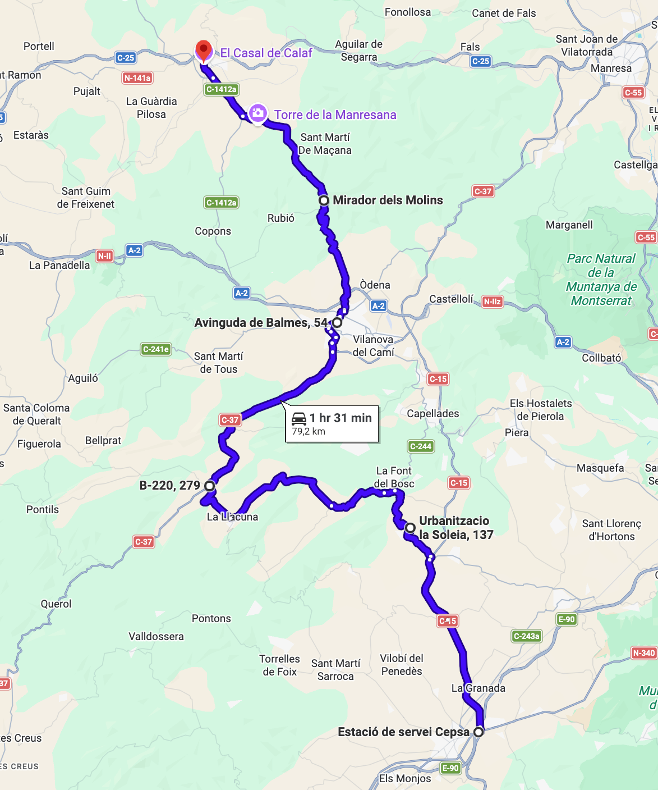
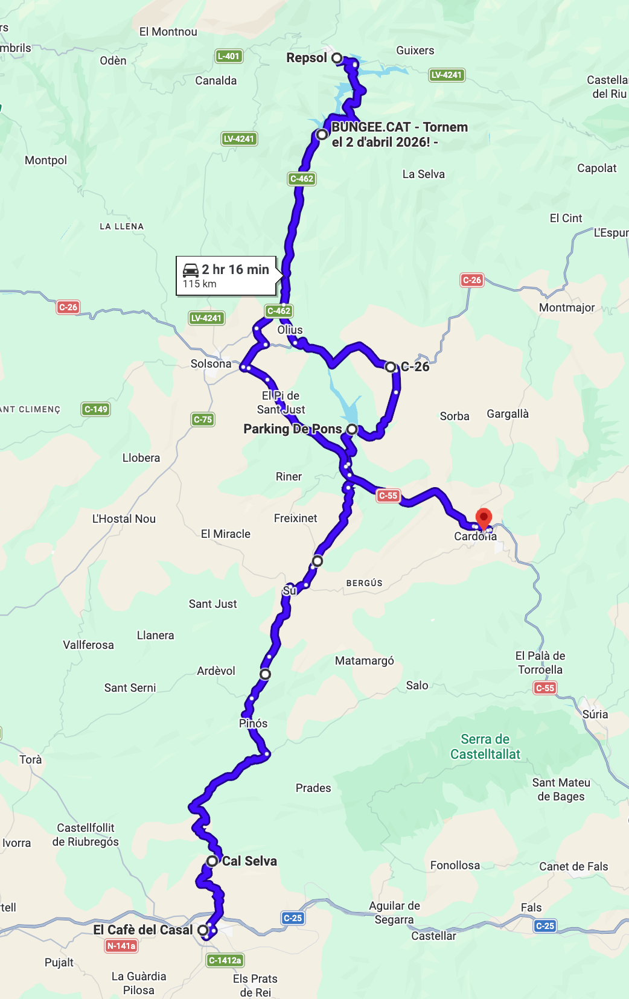

# Cardona

Ruta intermedia con un poco de todo: curvas, caminos rurales, pantanos y un castillo.

Total: 194 km (3h 47min).

### Parte 1

Ruta: 79.2 km (1h 31min)
[https://maps.app.goo.gl/vCdCGGZaqz85DCAZ7](https://maps.app.goo.gl/vCdCGGZaqz85DCAZ7)

- 🏁 Estació de servei Cepsa (Vilafranca del Penedès)
- Sant Quintí de Mediona
- La Llacuna
- Igualada
- 🅿️ Mirador dels Molins
- 🍔 El Cafè del Casal (Calaf)

Parada opcional en el Mirador dels Molins (espacio para 10 motos pero no muchas más). Bocatas en El Cafè del Casal.

### Parte 2

Ruta: 115 km (2h 16min)
[https://maps.app.goo.gl/Bj4BwhU1Ndsi5bwc6](https://maps.app.goo.gl/Bj4BwhU1Ndsi5bwc6)

- 🍔 El Cafè del Casal (Calaf)
- Sant Pere de l'Arç
- Pinós
- Su
- 🅿️ Pantà de Sant Ponç
- Olius
- 🅿️ Pantà de la LLosa del Caval
- ⛽️ Sant Llorenç de Morunys
- 🅿️ Castell de Cardona (Cardona)

Parada en la presa de Sant Ponç. Parada en el mirador de la presa de la LLosa del Caval. Repostaje opcional en Sant Llorenç y vuelta por la misma carretera de la Llosa. Parada y fin de la ruta en Castell de Cardona (aparcamiento amplio aunque concurrido).

