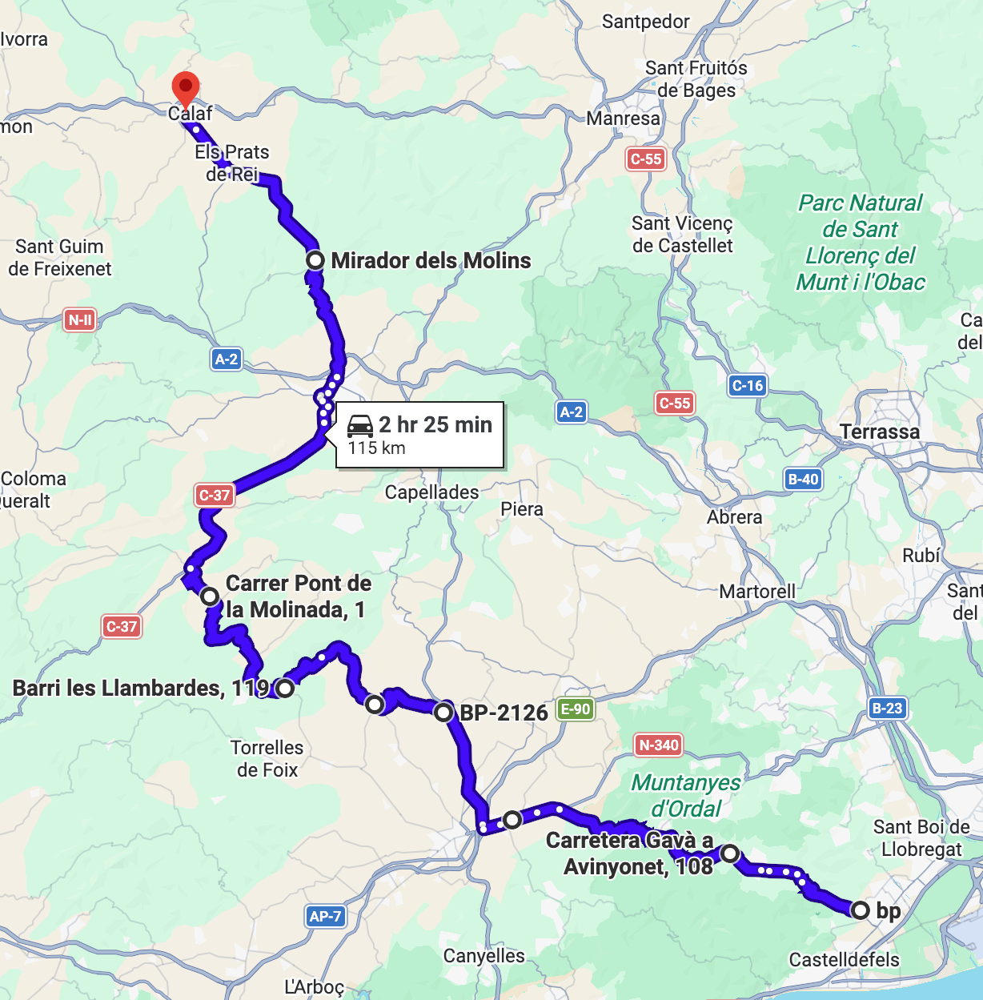
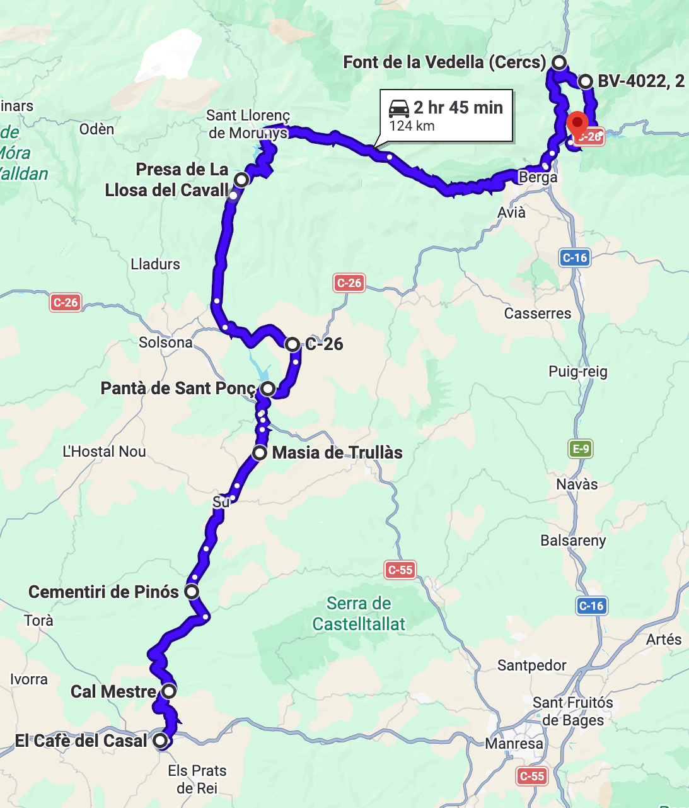

# Pantanos

Ruta variada que visita los pantanos de Sant Ponç, Llosa del Cavall y la Baells.

Total: 239 km (5h 10min).

# Parte 1

Ruta: 115 km (2h 25min)
[https://maps.app.goo.gl/km197oZmDmsRnZhy8](https://maps.app.goo.gl/km197oZmDmsRnZhy8)

- 🏁 BP La Bòbila (Gavà)
- Begues
- ⛽️ bonÀrea (Sant Cugat Sesgarrigues)
- Guardiola de Font-Rubí
- Font-Rubí
- La Llacuna
- Igualada
- 🅿️ Mirador dels Molins
- 🍔 El Cafè del Casal (Calaf)

Arranque desde la BP de Gavà. Curvas de Font-Rubí hasta La Llacuna. Parada opcional en el Mirador dels Molins.

# Parte 2

Ruta: 124 km (2h 45min)
[https://maps.app.goo.gl/uhWmRBuUoM24Uo2b9](https://maps.app.goo.gl/uhWmRBuUoM24Uo2b9)

- 🍔 El Cafè del Casal (Calaf)
- Pinós
- Su
- 🅿️ Pantà de Sant Ponç
- Olius
- 🅿️ Pantà de la Llosa del Cavall
- Berga
- 🅿️ Embassament de la Baells

Caminos escondidos hasta Sant Ponç. Paradas en las presas de Sant Ponç y la Llosa. Carretera de Berga y vuelta al Embassament de la Baells.
