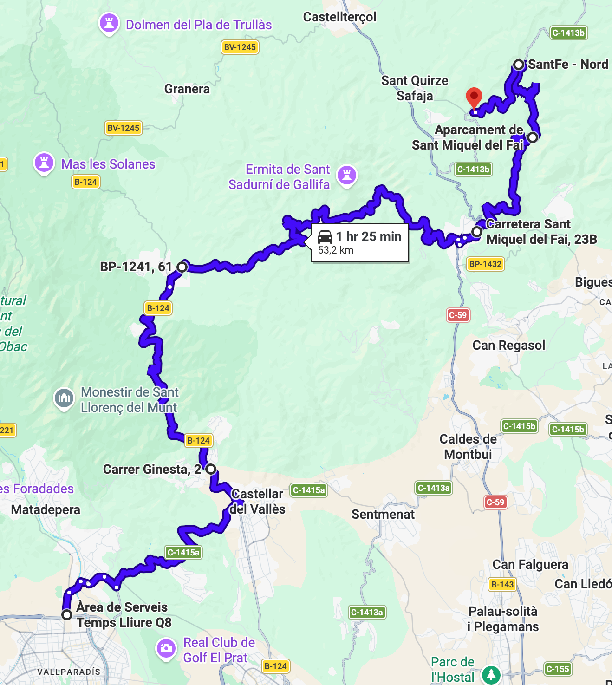
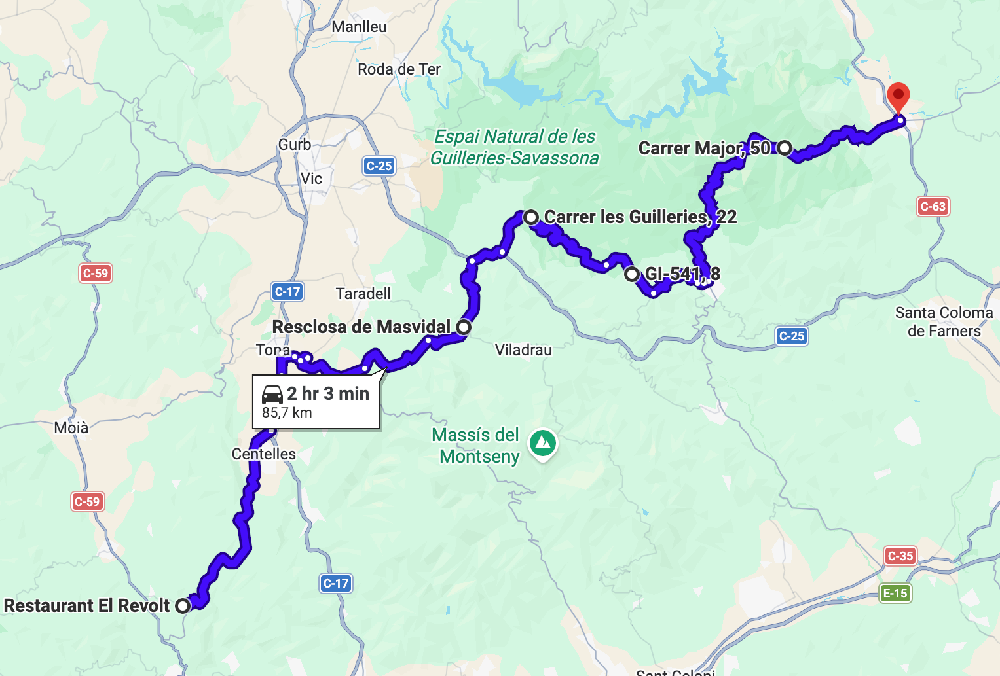
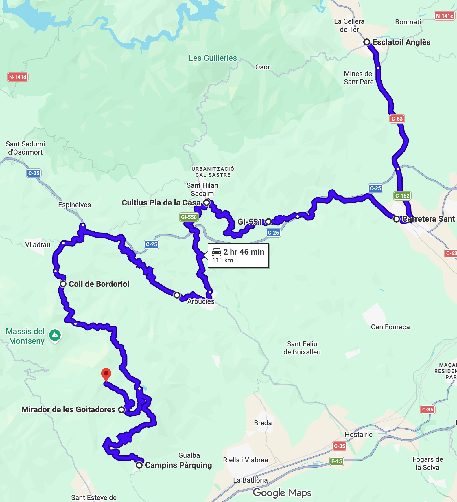
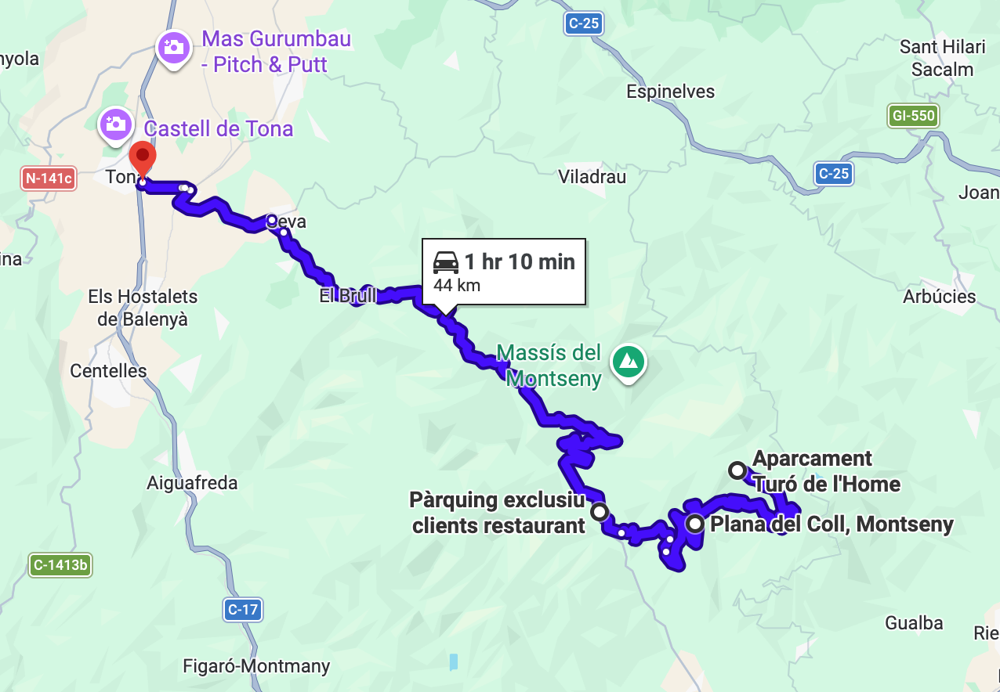

# Montseny (Versión extendida)

Ruta circular por el Montseny, calentando por Sant Llorenç Savall y Sant Miquel del Fai. Ampliada incluyendo las curvas de Bojons, Sant Hilari y Arbúcies.

Total: 292 km (7h 24min).

### Parte 1

Ruta: 53 km (1h 25min)
https://maps.app.goo.gl/WT4SDvdaMN81Ca7y7

- ⛽️ Àrea de Serveis Temps Lliure Q8 (Terrassa)
- Castellar del Vallès
- Sant Llorenç Savall
- Sant Feliu de Codines
- 🅿️ Sant Miquel del Fai
- 🍔 El Revolt (Sant Quirze Safaja)

Parada opcional en Sant Miquel del Fai (parking oficial con reserva, cerrado hasta abril). Carretera estrecha muy bonita.

### Parte 2

Ruta: 85 km (2h 3min)
https://maps.app.goo.gl/CL2UEvgEBLVXyDpm7

- 🍔 El Revolt (Sant Quirze Safaja)
- Centelles
- Seva
- Bojons
- 🅿️ Baldufa gegant (Sant Hilari Sacalm)
- Osor
- ⛽️ Esclatoil Anglès (Anglès)

Desvío en Masvidal antes de Viladrau, hacia Bojons por carretera estrecha y bonita. Parada opcional en la peonza gigante. Repostaje en Anglès.

### Parte 3

Ruta: 110 km (2h 46min)
https://maps.app.goo.gl/ro618NT1GhC8eCUW8

- ⛽️ Esclatoil Anglès (Anglès)
- Santa Coloma de Farners
- Sant Hilari Sacalm
- Arbúcies
- Campins
- 🅿️ Mirador de les Goitadores
- 🅿️ Turó de l'Home

Curvas infinitas hasta antes de Viladrau. Baja a Campins para volver a subir por el Mirador de les Goitadores (parada opcional). Parada opcional en el Aparcament Turó de l'Home (el Turó de l'Home está a 1.5km andando).

### Parte 4

Ruta: 44 km (1h 10min)
https://maps.app.goo.gl/7xdV82FggBaSXiK76

- 🅿️ Turó de l'Home
- Montseny
- Seva
- ⛽️ BonÀrea Energia (Tona)

Vuelta abierta después de Tona.

