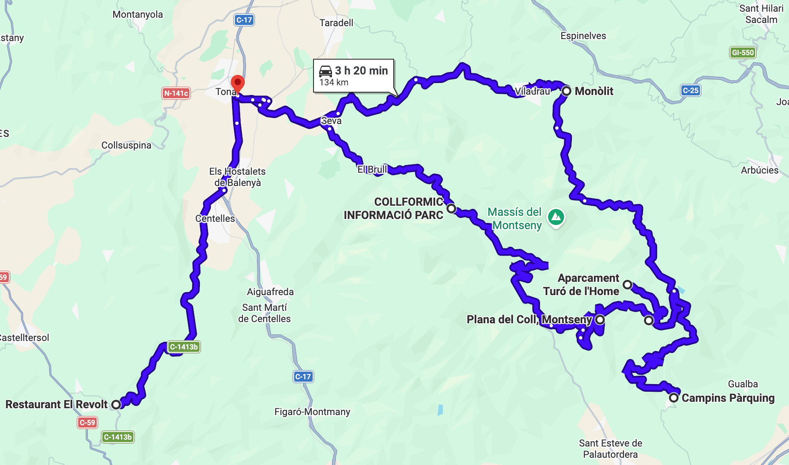

# Montseny

Ruta circular por el Montseny, calentando por Sant Llorenç Savall y Sant Miquel del Fai.

Total: 187 km (4h 45min).

### Parte 1

Ruta: 53 km (1h 25min)
[https://maps.app.goo.gl/WT4SDvdaMN81Ca7y7](https://maps.app.goo.gl/WT4SDvdaMN81Ca7y7)

- ⛽️ Àrea de Serveis Temps Lliure Q8 (Terrassa)
- Castellar del Vallès
- Sant Llorenç Savall
- Sant Feliu de Codines
- 🅿️ Sant Miquel del Fai
- 🍔 El Revolt (Sant Quirze Safaja)

Parada opcional en Sant Miquel del Fai (parking oficial con reserva, cerrado hasta abril). Carretera estrecha muy bonita.

### Parte 2

Ruta: 134 km (3h 20min)
[https://maps.app.goo.gl/y9D4wXXRGgdLZd2A9](https://maps.app.goo.gl/y9D4wXXRGgdLZd2A9)

- 🍔 El Revolt (Sant Quirze Safaja)
- Centelles
- ⛽️ BonÀrea Energia (Tona)
- Seva
- Viladrau
- Campins
- 🅿️ Mirador de les Goitadores
- 🅿️ Aparcament Turó de l'Home
- Montseny
- Seva
- ⛽️ BonÀrea Energia (Tona)

Repostaje en BonÀrea (Tona) antes de iniciar el Montseny. Parada en el Mirador de les Goitadores. Parada opcional en el Aparcament Turó de l'Home (el Turó de l'Home está a 1.5km andando).

