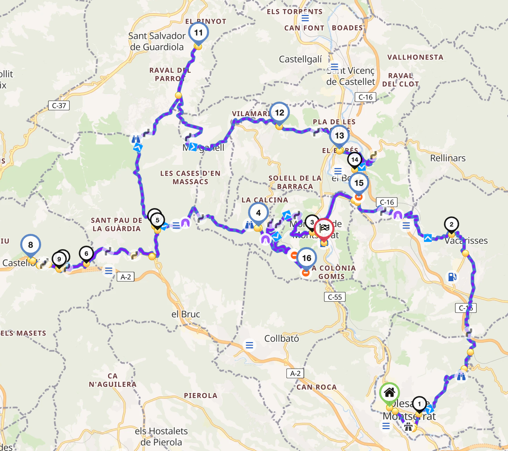

# Montserrat escénica

Paseo circular por Montserrat, parando en varios puntos de interés. Opcionalmente, ruta extendida alrededor de Manresa.

Total: 313 km (~6h 29min sin contar paradas).

# Parte 1

Ruta: 106 km (2h 18min sin contar paradas) https://kurv.gr/eSTyL

- ⛽️ bonÀrea (Olesa de Montserrat)
- Vacarisses
- Monistrol de Montserrat
- 🅿️ Capella de Santa Cecília de Montserrat
- Coll del Bruc
- 🅿️ Pumptrack de Castellolí
- Coll del Bruc
- 🍔 Ca la Iaia
- Marganell
- 🍔 Can Ferreroles (alternativa)
- 🅿️ Pont Vell de Castellbell i el Vilar
- 🅿️ Mirador de La Bauma
- 🅿️ Monestir de Montserrat
- ⛽️ Repsol (Monistrol de Montserrat)

La Parte 1 es una visita escénica alrededor de Montserrat con varias paradas planeadas en puntos de interés y miradores.

Comienzo desde Olesa de Montserrat, pasando por Vacarisses, recorriendo carreteras locales con vistas a Montserrat. Inicio clásico de la subida por Monistrol. Descenso por Coll del Bruc hasta Castellolí y vuelta hasta Ca la Iaia. Salida hacia Marganell y Castellbell i el Vilar para subir hasta el mismo Monasterio de Montserrat.

# Parte 2 (Opcional)

Ruta: 207 km (4h 11min) https://kurv.gr/GZqxw

- ⛽️ Repsol (Monistrol de Montserrat)
- Rellinars
- ⛽️☕️ Àrea de Serveis Temps Lliure Q8 (Terrassa)
- Talamanca
- Navarcles
- Artés
- Avinyó
- Balsareny
- Súria
- Salo
- ⛽️🍔 Calaf
- Igualada
- Coll del Bruc
- 🅿️ Monestir de Montserrat
- ⛽️ Repsol (Monistrol de Montserrat)

La Parte 2 es una ruta más continua, sin paradas planeadas aparte de un tentenpié opcional.

Comienzo desde Monistrol, saliendo por Rellinars hasta la Q8 de Terrassa y clásica subida por Matadepera/Talamanca hasta Navarcles. Ruta Avinyó-Balsareny-Súria-Salo hasta Calaf, parando opcionalmente a tomar algo y repostar. Finalmente, bajada por la carretera de los molinos y subida de nuevo al monasterio de Montserrat por Coll del Bruc.
