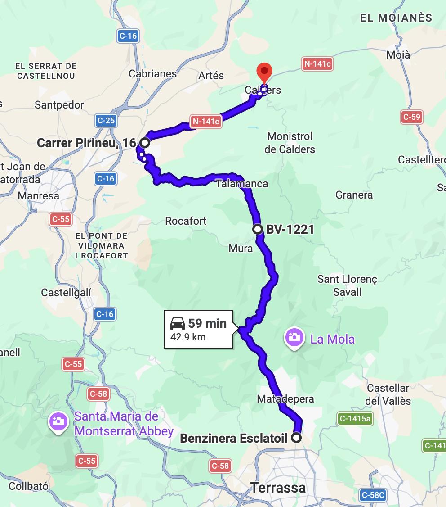
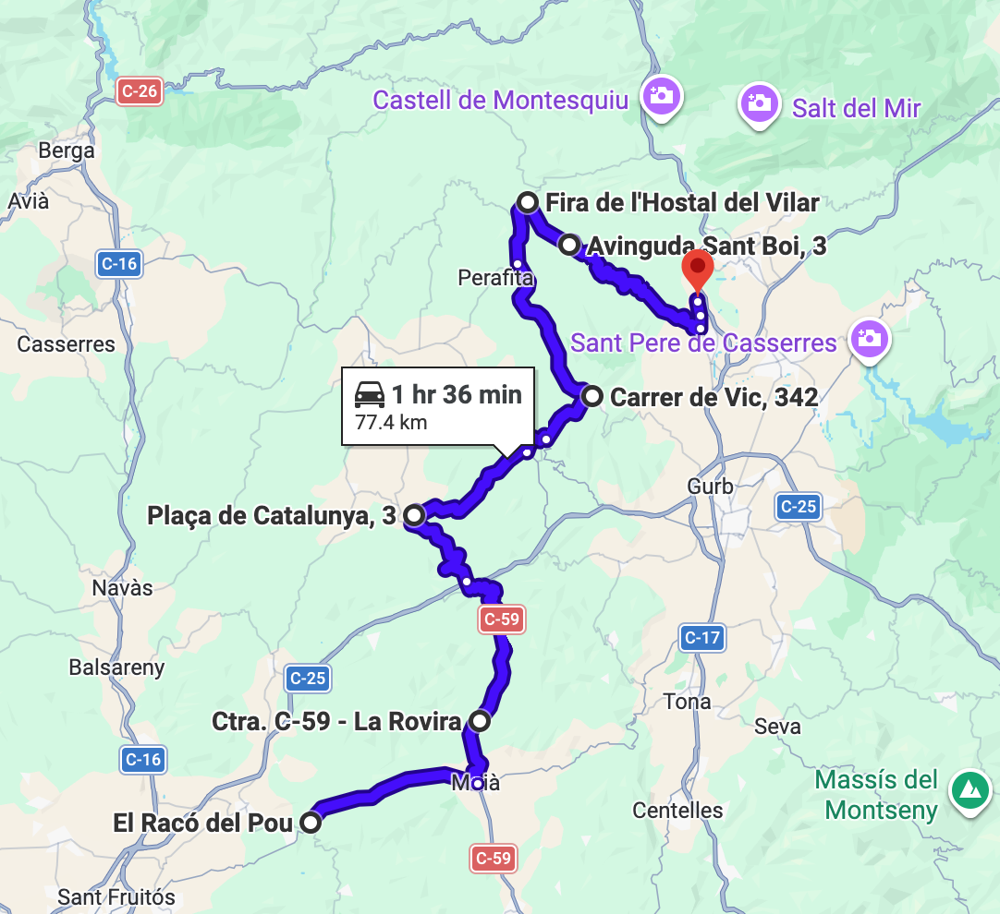
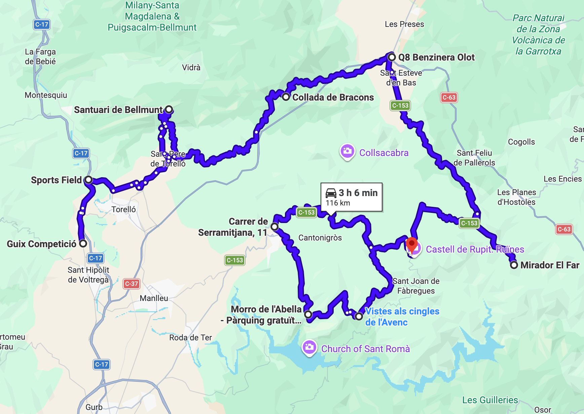
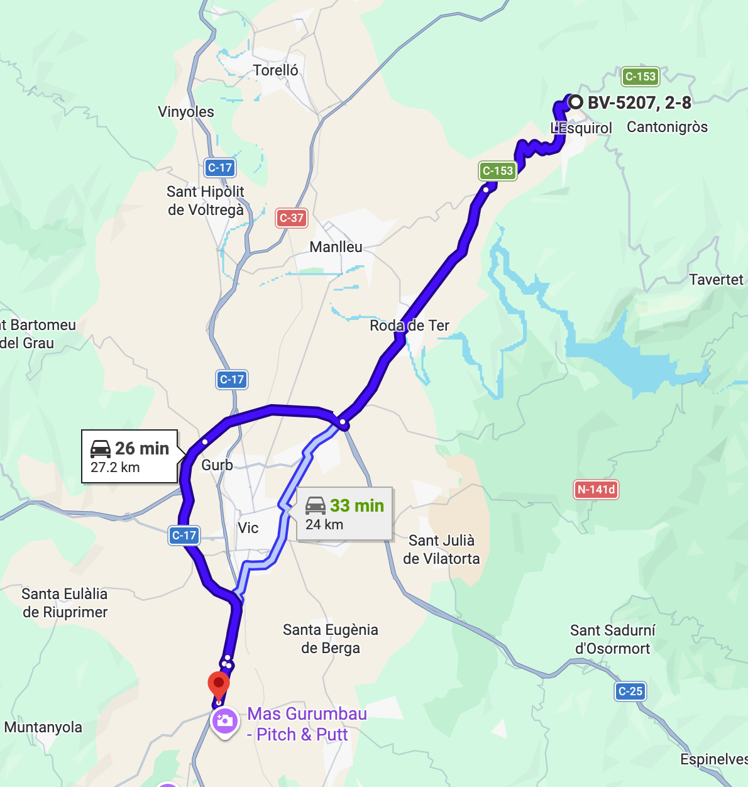
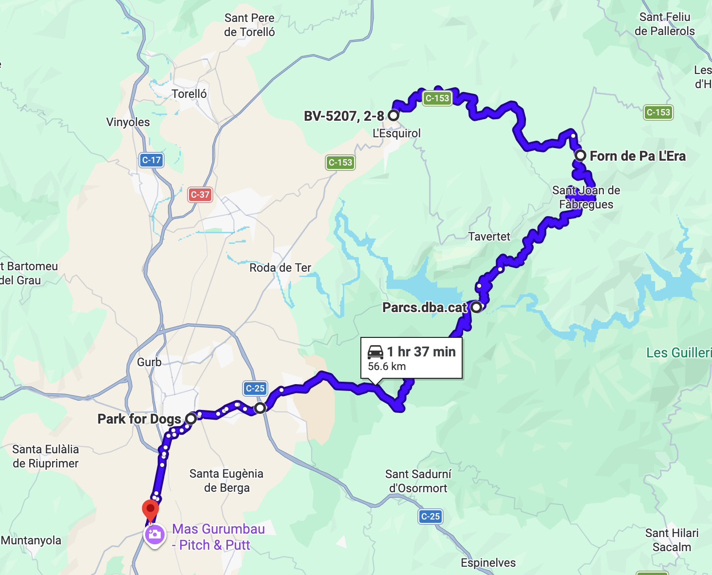
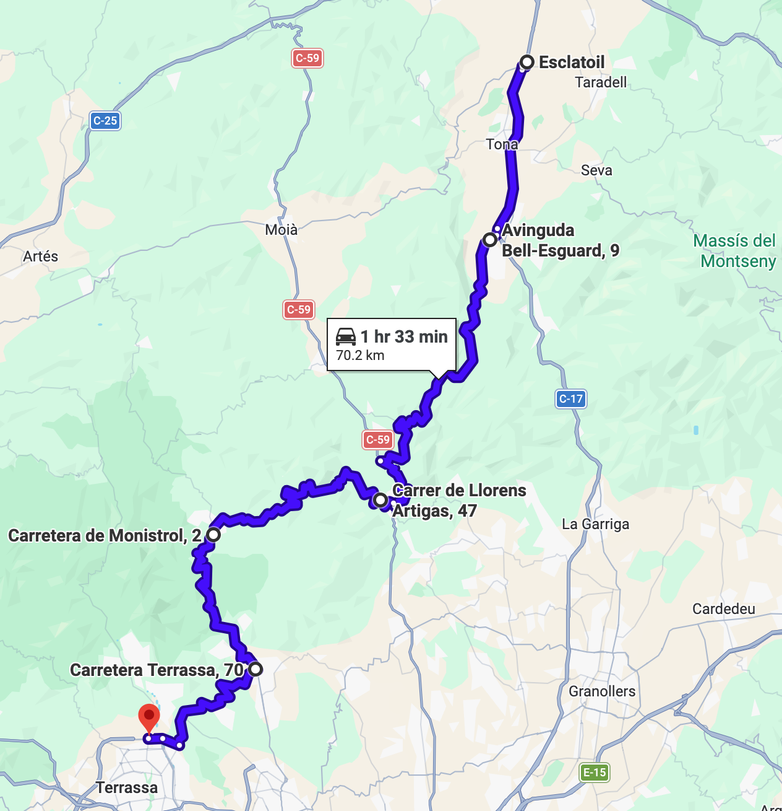

# Rupit

Ruta circular centrada en la zona de Rupit y sus alrededores escénicos. Se inicia con curvas para calentar motores (partes 1 y 2); recorre caminos escénicos, miradores y visita Rupit para descansar y tomar algo (parte 3); termina con curvitas de postre opcional (partes 4 y 5). El tiempo no incluye las posibles paradas.

348 km (8h) 
348 km (8h 35min) (Opción B)

### Parte 1

Calentamiento por curvitas y almuerzo.

- ⛽️ Esclatoil Terrassa
- Matadepera
- Talamanca
- Navarcles
- 🍔 Calders (El Racó del Pou)

43 km (59min)

### Parte 2

Curvitas por el LLuçanès.

- 🍔 Calders (El Racó del Pou)
- Moià
- L'Estany
- Oristà
- Sant Bartomeu del Grau
- Sant Boi del Lluçanès
- Sant Hipòlit de Voltregà
- ⛽️ Repsol

77 km (1h 36min)

### Parte 3

Miradores, carreteras estrechas y caminos escénicos. Parada en Rupit para descansar, visitar el pueblo y tomar algo (sin reserva).

- ⛽️ Repsol
- Sant Pere de Torelló
- 🅿️ Santuari de Bellmunt¹
- Coll de Bracons
- ⛽️ Q8 Benzinera Olot
- 🅿️ Mirador El Far
- L'Esquirol
- 🅿️ Morro de l'Abella²
- Tavertet³
- 🅿️ Vistes als cingles de l'Avenc³
- 🅿️ Mirador del Silenci³
- 🏰 Rupit⁴
- 🖼️ Salt de Sallent⁵ (Opcional)

116 km (3h 6min)

    ¹ El Santuari está a 10 minutos andando del aparcamiento. 
    ² El parking del Morro de l'Abella podría estar cerrado o ser de pago (3€ en monedas). En caso de estar abierto, podría tener un límite de 15 minutos. 
    ³ La entrada a Tavertet podría estar cerrada con barrera en sentido Tavertet-Rupit. 
    ⁴ El parking de Rupit es de pago (3€ todo el día o gratuito hasta 30min). Admite tarjeta y monedas, pero podría no admitir contactless. 
    ⁵ El camino al Salt de Sallent es opcional, se hace andando y suma aproximadamente 1 hora. 

### Parte 4

#### Opción A: Salida directa

Carretera directa a la Parte 5.

- 🅿️ Rupit
- L'Esquirol
- Vic
- ⛽️ Esclatoil Malla

42 km (46min)

#### Opción B: Salida escénica

Camí de Rupit a Sau.

- 🅿️ Rupit
- 🅿️ Mirador del Pantà de Sau¹
- Vic (sur)
- ⛽️ Esclatoil Malla

42 km (1h 20min)

    ¹ El Camí de Rupit a Sau es boscoso, estrecho y exigente, con curvas cerradas y grandes pendientes. Está asfaltado pero podría presentar desperfectos, gravilla, barro, ramas, etc. Además, el sentido Rupit-Sau es en bajada. No es asconsejable hacerlo en malas condiciones climáticas o con poca luz.

### Parte 5

Postre por curvitas.

- ⛽️ Esclatoil Malla
- Centelles
- Sant Feliu de Codines
- Sant Llorenç Savall
- Castellar del Vallès
- ⛽️ Àrea de Serveis Temps Lliure Q8

70 km (1h 33min)

