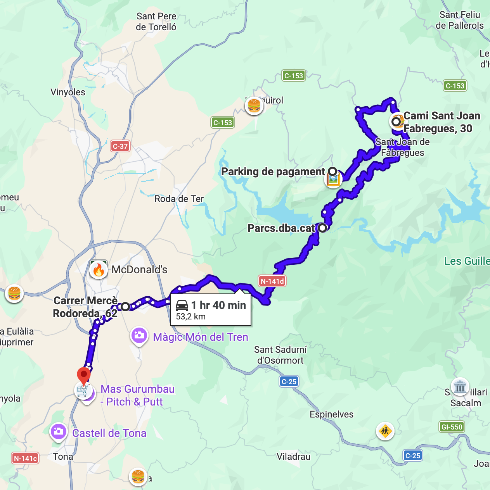
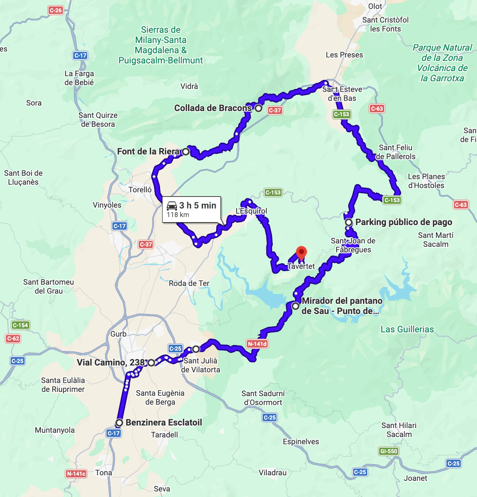

# Rupit

Ruta centrada en la zona de Rupit y alrededores: Sau, Tavertet y Bracons. La ruta comienza por Sant Llorenç Savall y San Miquel del Fai, para llegar a la zona de Rupit.

Total: 203 km (4h 30min) sin las partes opcionales.

### Parte 1

Ruta: 53 km (1h 25min)
https://maps.app.goo.gl/2X2woED5DZTHCrR69

- 🏁 Àrea de Serveis Temps Lliure Q8 (Terrassa)
- Castellar del Vallès
- Sant Llorenç Savall
- 🅿️ Sant Miquel del Fai
- 🍔 Restaurant El Revolt

Parada opcional en Sant Miquel del Fai para visitar el monasterio y/o sus alrededores. Parking oficial con reserva, cerrado hasta 20 de Marzo. Hay espacio para aparcar fuera en gravilla, si los coches lo permiten. Carretera estrecha y muy bonita.

### Parte 2

Ruta: 23 km (26 min)
https://maps.app.goo.gl/PN2Gsphv4ihNYGVY6

- 🍔 Restaurant El Revolt
- Centelles
- ⛽️ Esclat

Travesía breve hasta Esclat, donde repostamos todos para iniciar la Parte larga de la ruta.

### Parte 3

Ruta: 127 km (2h 47min)
https://maps.app.goo.gl/zt6ZX43cWhkiVgVg6

- ⛽️ Esclat
- San Martín Sescorts
- 🅿️ Rupit
- 🅿️ Mirador El Far
- Sant Esteve d'en Bas
- Collada de Bracons
- Sant Vicenç de Torelló
- San Martín Sescorts
- 🅿️ Tavertet

Parada opcional en Rupit (parking de pago) para ver el pueblo y su puente colgante. Parada opcional en Mirador El Far. Parada opcional (parking de pago) en el mirador de Tavertet para terminar la ruta.

---

### Parte 4 (Opcional)

Ruta: 53 km (1h 40min)
https://maps.app.goo.gl/qqpW8yHWmj6N2sFs5

- 🅿️ Tavertet
- Rupit
- 🅿️ Mirador del Pantà de Sau
- Folgueroles
- ⛽️ Esclat

Sólo para aventureros/as. Carretera estrecha y boscosa, no recomendable de noche ni en solitario. Salida de Tavertet por camino asfaltado, y continuación por el camino de Rupit a Sau.

---

### Parte 3 (Alternativa)

Ruta: 118 km (3h 5min)
https://maps.app.goo.gl/uqNV995byocxDQGE9

- ⛽️ Esclat
- Folgueroles
- 🅿️ Mirador del Pantà de Sau
- 🅿️ Rupit
- 🅿️ Mirador El Far
- Sant Esteve d'en Bas
- Collada de Bracons
- Sant Vicenç de Torelló
- San Martín Sescorts
- 🅿️ Tavertet

Entrada a Rupit por la carretera de Sau (rodeada de entorno natural). Parada opcional en el mirador del Pantà de Sau. Continuación por el camino de Sau a Rupit (carretera estrecha y boscosa, sólo recomendable de día y en grupo). Parada opcional en Rupit (parking de pago) para ver el pueblo y su puente colgante. Parada opcional en Mirador El Far. Parada opcional (parking de pago) en el mirador de Tavertet para terminar la ruta.

Hace el camino de la "Parte 4 (Opcional)" a la ida (más recomendable) y deja atrás un par de tramos entre Tavertet y Rupit.

