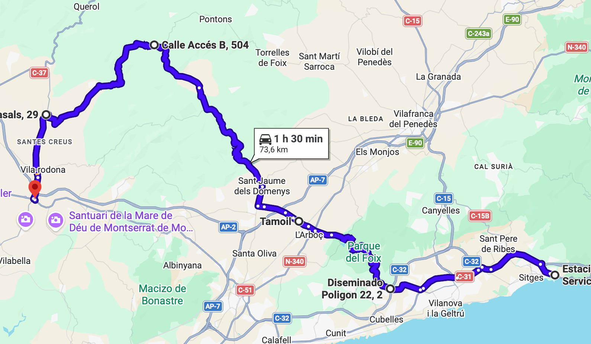
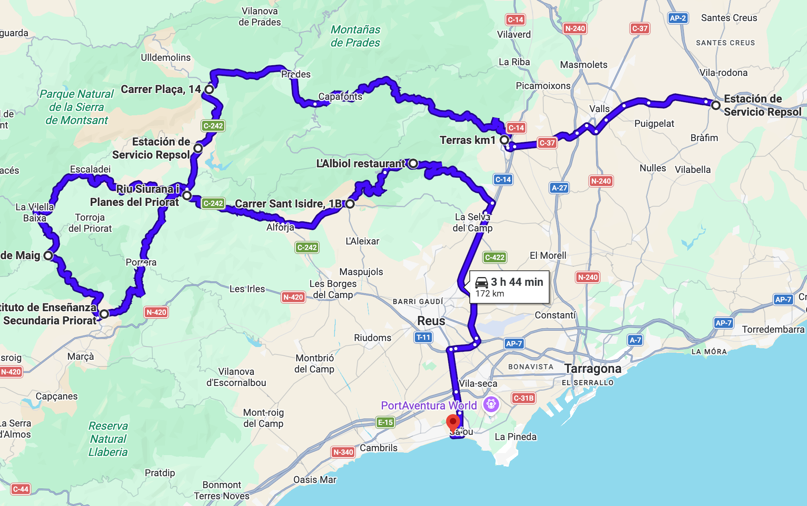

# Prades

Ruta casi circular por las Muntanyes de Prades, con paradas para reagrupar, gasolina y café. Final opcional en la playa de Salou.

Total: 253 km (5h 10min)

### Parte 1

Ruta: 81 km (1h 26min)
[https://maps.app.goo.gl/PpPxiGjFh1AZ1Tid9](https://maps.app.goo.gl/PpPxiGjFh1AZ1Tid9)

- ⛽️ Repsol (Sitges)
- Pantà del Foix
- 🅿️ Tamoil (L'Arboç)
- Valldossera
- Santes Creus
- 🍔 Restaurante Les 4 Carreteres (Vila-rodona)

Calentando motores por el Pantà del Foix y la zona de Valldossera para ganarnos el desayuno.

### Parte 2

Ruta: 172 km (3h 44min)
[https://maps.app.goo.gl/A6Rt5y9sinyxEuXk8](https://maps.app.goo.gl/A6Rt5y9sinyxEuXk8)

- ⛽️ Repsol (Vila-rodona)
- Alcover¹
- Capafonts
- Prades
- ⛽️ Repsol (Cornudella de Montsant)
- Poboleda
- La Vilella Baixa
- ☕️ Café Flor de Maig (Gratallops)
- Falset
- Porrera
- Alforja
- Vilaplana
- 🅿️ L'Albiol
- 🏖️ Xiringuito Elektra (Salou)

Vuelta por algunas de las reviradas carreteras de las Muntanyes de Prades. Terminamos en L'Albiol y, opcionalmente, bajamos hasta Salou a pasar un rato agradable en la playa.

¹ _Para cruzar Alcover, es recomendable rodearla siguiendo [esta ruta](./alcover.png). No figura en la ruta principal porque se llegó al tope de puntos intermedios._

