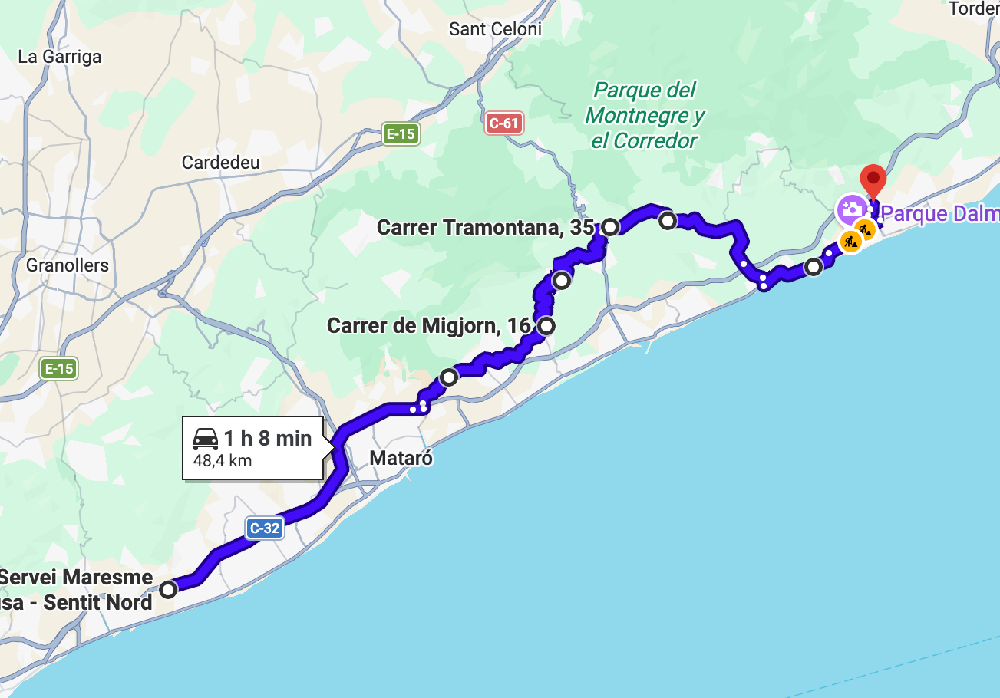
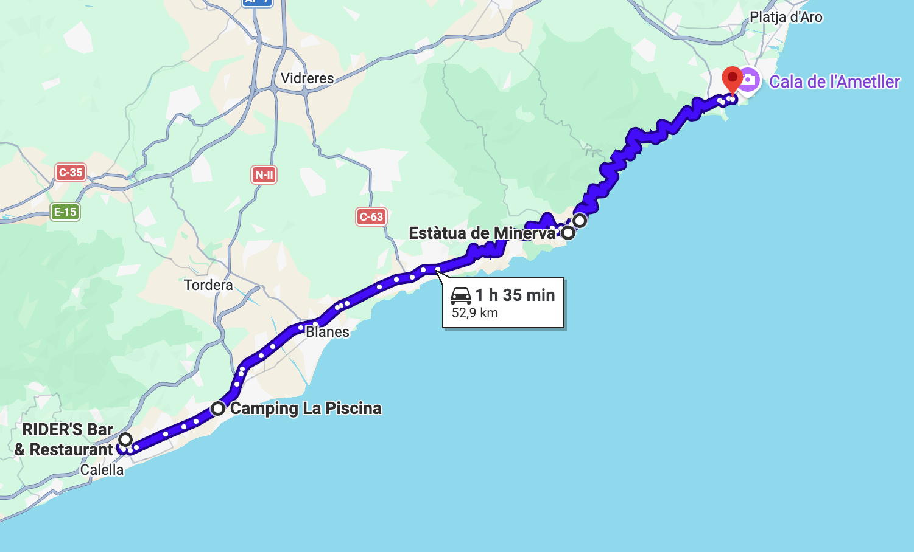

# Tossa de Mar (Versión corta)

Ruta de ida a las 360 curvas de Tossa de Mar.

### Parte 1

Ruta: 48 km (1h 7min)
[https://maps.app.goo.gl/7no92fVgNmDHEgdp7](https://maps.app.goo.gl/7no92fVgNmDHEgdp7)

- ⛽ Àrea Servei Maresme
- Curvas de Arenys
- 🅿️ Mirador Platja de la Roca Grossa (foticos y vistas bonitas)
- 🍔 RIDER'S Bar & Restaurant

### Parte 2

Ruta: 53 km (1h 35min)
[https://maps.app.goo.gl/VzUGjGSt7wC3D1JP9](https://maps.app.goo.gl/VzUGjGSt7wC3D1JP9)

- 🍔 RIDER'S Bar & Restaurant
- Curvas de entrada a Tossa
- 🅿️ Estàtua de Minerva (mirador bonito dentro Tossa de Mar)
- Mirador de Tossa de Mar (el "Pies Colgando" de Tossa)
- 360 curvas de Tossa
- 🅿️ Pàrquing Sant Feliu
- ℹ️ Aquí nos reagruparemos y hablaremos de buscar aparcamiento en la zona de Sant Feliu o Platja d'Aro, para luego reunirnos en algún chiringuito de playa.

